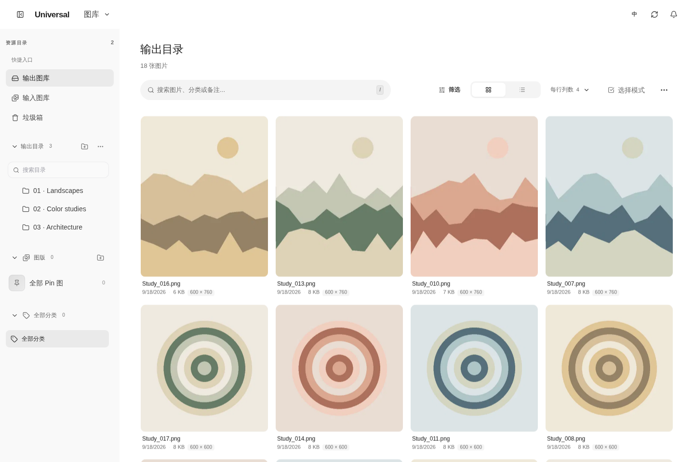

# 验证记录 · 1.3.0-rc.1

日期：2026-09-18。基线：上游 `87960b0`，本地工作分支 `improvement/minimal-workspace`。这是候选版本，不是上游正式发布。

## 实际执行结果

| 检查 | 结果 |
|---|---|
| Python 后端测试（Linux / Python 3.13） | **103 passed** |
| 前端 Vitest（24 个测试文件） | **108 passed** |
| TypeScript typecheck | 通过 |
| ESLint | 通过 |
| npm audit 安全审计 | 本次查询 **0 vulnerabilities** |
| Vite 生产构建 | 通过，前端已包含在安装包中 |
| Vite manifest / 入口资源检查 | 14 项资源引用通过 |
| 版本与更新日志一致性 | 通过 |
| Python compileall | 通过 |
| git diff --check | 通过 |
| Chromium 桌面/移动端冒烟 | 通过；未发现 pageerror；无横向溢出 |

浏览器测试覆盖：工作区下拉、图库/词库/工作区/设置切换、搜索过滤、网格/列表、更多菜单与 Esc、打开图片详情并关闭、移动端打开/关闭侧栏、侧栏关闭后的屏幕位置。

示例界面图片由预览脚本程序绘制，仅用于 UI 验证，不是用户实际生成结果。预览运行真实 Gallery 路由与生产前端，但使用模拟 folder_paths 和隔离临时目录，**不是完整 ComfyUI 执行环境**。



## 新增回归重点

- 相同 seed/词库内容的缓存指纹稳定，词库更改后指纹变化；polling 的 NaN 失效契约。
- random / sequential / polling 模式按值去重。
- 词库符号链接逃逸被拒绝。
- 不完整提示词不构造误导性的同 Prompt 指纹。
- 多采样器歧义和动态节点不被静态猜测。
- Snapshot 节点的已解析文字和 PNG 元数据往返读取。
- Hamming 候选索引与暴力算法逐对一致（不同阈值）。
- 暂存、目标迁移、状态提交阶段的故障注入及回滚。
- 交换文件名、跨卷复制中断、已有目标冲突、回滚失败日志保留。
- 未解决日志阻止新的日志化操作。
- 垃圾箱账本中途失败恢复全部文件和状态。
- 系统回收站失败不移除插件垃圾箱记录。
- 目录垃圾箱恢复、input 图源恢复、禁止合并到子目录。
- 请求取消后 worker 仍完成、队列槽位没有提前释放。
- 非对象 JSON 请求和不合法批量路径被拒绝。
- RC 与正式版的更新版本排序。

真实浏览器测试还发现上游缩略图的透明 skeleton 伪元素会拦截图片点击；已补上 `pointer-events: none`，完成加载后停止 shimmer，且添加 Enter/Space 打开图片的键盘操作。

## 未完成的实机验收 / 已知边界

1. 未在真实 ComfyUI/GPU 执行器连续出图，缓存、Snapshot 保存和插件组合需实机验证。
2. Windows/macOS CI 仅新增或保留配置，本次没有远程运行这些 CI。
3. 未对万张图库、NAS、多卷目录操作和长时间连续运行做性能/稳定性压测。
4. 文件回滚是异常补偿和恢复日志，不承诺断电后自动恢复或跨文件系统 ACID。
5. 专用 worker 避免直接占用 HTTP 事件循环，但不是带进度/取消接口的独立后台作业服务；线程仍共享 GIL。
6. 元数据解析仍保守支持常见链路；多采样器分支、任意 conditioning 和第三方自定义逻辑不会被假装完整解析。
7. 大型 service/App 文件只提取了本次关键职责，没有冒险做未经充分验证的全量架构重写。

## 如何复验

详见 `UPGRADE-1.3.0-rc.1.zh-CN.md`。浏览器冒烟额外需要 Playwright 和 Chromium：

```bash
python -m pip install playwright
python -m playwright install --with-deps chromium
# 终端 1
python scripts/preview.py
# 终端 2
python scripts/browser_smoke.py --url http://127.0.0.1:8189
```

在真实 ComfyUI 中建议先用复制出来的 20–100 张图，验证：生成两次、修改词库再生成、移动/重命名、删除/恢复、同名冲突、原图源恢复、PNG 快照读取和旧工作流加载。通过后再接入正式图库。
